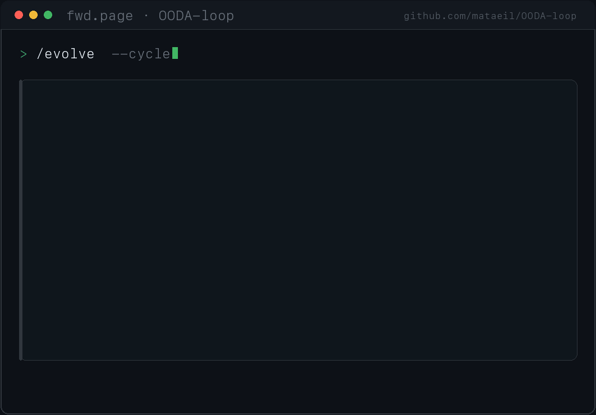

# OODA-loop
한국어 | [English](README.md)

**새벽 3시에 당신의 사이드 프로젝트를 운영하고, 아침에 검토할 작은 PR을 열고, 당신이 실제로 머지하는 PR에 맞춰 스스로 재조준합니다.**

매 사이클 끝에 출력되는 화면입니다 — cron 작업·라운드로빈 루프·스킬 팩 그 무엇도 만들 수 없는 단 하나의 아티팩트. 이유는 **LEARN** 라인, *당신의* 머지/리젝트 결정으로부터 재조준하는 그 줄입니다:

<p align="center">
  
</p>

`/ooda-status --share`로 언제든 최신 카드를 다시 렌더할 수 있습니다.

<details>
<summary>텍스트가 편하신가요? 같은 Cycle Card입니다.</summary>

```
┌─ fwd.page · OODA-loop cycle #152 ────────────── 2026-04-14 03:14 UTC ─┐
│                                                                        │
│  OBSERVE   4 domains · test_coverage dropped 91% → 84% overnight       │
│  ORIENT    flaky-retry pattern confirmed (3rd time); coverage now      │
│            the most stale + highest-signal domain                      │
│  DECIDE    test_coverage won (score 11.3) · confidence 0.74 · gate ✓   │
│  ACT       opened PR #29 — "wrap flaky network suite in retry"         │
│            └ Risk Tier 1 · 2 files · draft — you merge                 │
│  LEARN  🔭 you rejected PR #28 yesterday →                             │
│            service_health confidence 0.74 → 0.54 ↓                     │
│            (reject −0.2, 2× faster than a merge's +0.1)                │
│         🔭 lens re-aimed → flaky-alert threshold 0.30 → 0.25           │
│  COST      +$0.04 · $0.38 today · hard cap $10 (auto-HALTs on breach)  │
│                                                                        │
│  HALT: inactive · Level 2 (Full observation)                          │
└────────────────────────────────────────────────────────────────────────┘
```
</details>

당신의 *살아있는* 사이드 프로젝트를 위한 자율 **운영(operations)** 레이어 — 무엇이 중요한지 판단하고 당신이 승인하는 작은 PR을 제안합니다. **지휘권은 당신에게:** 제안하고, 당신이 머지하거나 리젝트하고, 모든 변경은 한 번에 되돌릴 수 있는 독립 PR이며, 당신의 결정에서 재조준합니다. *(auto-merge는 opt-in이고 저위험 티어만, Level 3에서만 — 켜기 전엔 꺼져 있습니다. 나쁜 배포 시 auto-revert도 opt-in.)*

**증거** *(저자 측정 — 직접 파일럿 권장)*: 두 개의 실제 프로젝트가 연속 운영. **[fwd.page](https://fwd.page)** (운영 중인 URL 단축 서비스)는 **152사이클 → PR 28개, 24개 머지(86%)**, **Lynceus** (국정감사 자동화)는 **119사이클 관찰 레벨(아직 PR 없음)**. 샌드박스에서는 **9개 언어/프레임워크 스택**에 걸쳐 60사이클, PR 36개, 컴파일·테스트 실패 관측 0건으로 깨끗하게 돌았습니다.

**$6,000짜리 서프라이즈를 줄 수 없습니다.** `touch agent/safety/HALT` 하나로 모든 게 즉시 멈춥니다. 모든 변경은 한 번에 되돌릴 수 있는 작은 PR(최대 20파일 / 500줄). 자기 안전 규칙은 건드리지 못합니다. 전형적 비용은 ~$1–2/day이고, **하드 일일 cap(기본 $10)을 넘기는 순간 자동으로 HALT를 생성**합니다. 첫 사이클과 Level 0은 관찰만 합니다.

> **[Claude Code](https://claude.ai/code) 필수.** 모든 명령어(`/ooda-setup`, `/evolve` 등)는 Claude Code 슬래시 커맨드입니다.

[](LICENSE)
[](https://claude.ai/code)
[](CONTRIBUTING.md)

---

## 빠른 시작

**설치** (택 1):

```bash
# 방법 A: Claude Code 플러그인 (권장)
/plugin marketplace add mataeil/OODA-loop
/plugin install ooda-loop

# 방법 B: Git으로 전역 설치
git clone https://github.com/mataeil/OODA-loop.git ~/.ooda-loop
~/.ooda-loop/install.sh
```

**프로젝트에 설정:**

```bash
cd your-project/
/ooda-setup           # 스택 자동 감지, config 생성
/evolve               # 첫 사이클 (관찰만)
/ooda-status          # 결과 확인
/ooda-status --share  # 공유용 Cycle Card
```

`/ooda-setup`이 프로젝트에 `config.json`과 `agent/state/`를 생성합니다. 관찰 중에는 소스 코드를 절대 수정하지 않습니다. **당신이 말하기 전까지 아무것도 바꾸지 않습니다.** Level 0은 관찰만. Level 3에서 PR을 엽니다.

---

## 무엇이 다른가?

"자율 에이전트" 프로젝트는 많이 보셨을 겁니다. 정직한 지도를 그려봅니다.

| | 무엇을 하나 | 차이점 |
|---|---|---|
| **코드 생성 에이전트** (Aider, Cline, OpenHands, Devin) | 명령하면 코드를 쓰고 PR에서 멈춤 | OODA-loop은 *무엇을* 할지 정하고 당신의 **살아있는** 프로젝트를 계속 돌림 — 일회성 코드젠이 아니라 운영 |
| **라운드로빈 루프** (continuous-claude / "Ralph" 루프) | 같은 프롬프트를 영원히 재실행 | OODA-loop은 **재조준**함: 당신의 머지/리젝트로 갱신되는 도메인별 confidence, RICE 우선순위 백로그, 학습된 임계값 — 매 루프 초기화하지 않음 |
| **자기재작성 에이전트** (ouroboros류) | 스펙터클을 위해 자기 소스를 재작성 | OODA-loop은 의도적 정반대: **HALT 파일·보호 경로·cost ledger·관찰 전용 첫 사이클** + 그들에겐 없는 271 실제 프로덕션 사이클 |
| **설정 / 스킬 팩** | 코딩용으로 에이전트를 *설정* | OODA-loop은 배포된 프로젝트를 Level 0→3 점진 자율 + 학습 루프로 **운영** |

이들 중 누구도 위 카드의 **LEARN** 라인을 보여줄 수 없습니다. 그게 쐐기(wedge)입니다.

---

## "학습"은 실제로 어떻게 작동하나

당신은 코드를 읽는 사람이니, 솔직하게 말합니다.

OODA-loop의 학습은 **결과 기반 휴리스틱 재조준(outcome-driven re-orientation)** 이지 머신러닝이 *아닙니다*. gradient도, fitness function도, 학습된 모델도 없습니다. 실제로 일어나는 일은:

- **Confidence**는 당신의 결정에 따라 도메인별로 움직입니다: PR을 **머지하면 +0.1**, **리젝트하면 −0.2**. 나쁜 베팅은 좋은 베팅이 보상받는 것의 2배로 벌받습니다.
- **Adaptive Lens** (`agent/state/{domain}/lens.json`)는 학습된 임계값·포커스 항목·발견된 신호를 축적합니다. 새 학습은 잠정적으로(confidence 0.3) 시작해 반복 확인 후에만(0.6) 활성화됩니다. **반증 증거는 확증 증거가 쌓이는 것보다 2배 빠르게 감쇠**합니다 — 잘못된 교훈은 빨리 죽습니다. 각 변경은 `lens_changelog.json`에 추가되어 LEARN 라인은 항상 감사 가능합니다.
- **3-tier 메모리**: 최근 20개 결정 → 주간 episode 요약 → 영구 principles로 캐스케이드.
- **언어 자기비평** ([Reflexion](https://arxiv.org/abs/2303.11366) 방식): 매 결정 사이클마다 에이전트가 한 줄 교훈 — 무엇을 했고 결과가 예상과 맞았는지 — 을 적어 `reflections.json`에 저장하고, 관련된 과거 교훈을 다음 Orient에 재주입합니다. 모델이 다시 읽는 텍스트일 뿐, 훈련이 아닙니다.

이것을 **proto-evolution**으로 보세요: 언어 자기교정을 통해 실제 결과로부터 조정되는, 명시적이고 검사 가능한 제어 루프 — RL도, gradient 갱신도 아닙니다. 우리는 "재조준했다", "조정했다", "후순위로 내렸다"라고 말하지 "훈련했다"거나 "가중치를 학습했다"고 말하지 않습니다. 모든 숫자는 당신이 읽고 감사할 수 있는 평문 JSON에 있습니다. 그 정직함이 핵심입니다: 검사할 수 있는 루프라야 신뢰할 수 있습니다.

---

## OODA 루프 (그리고 Orient가 중요한 이유)

한국전쟁 F-86 조종사였던 John Boyd는 이후 20여 년에 걸쳐 왜 어떤 조종사가 공중전에서 이기는지 풀어냈습니다. 그 답은 — 1970~90년대에 정련된, 조종석을 떠난 한참 뒤의 것 — 더 빠른 비행기가 아니라 연속으로 돌며 매 결과가 다음을 갱신하는 의사결정 사이클이었습니다: **관찰(Observe), 정향(Orient), 결정(Decide), 행동(Act).**

Boyd의 진짜 통찰은 **Orient**였고, 그의 실제 다이어그램(*The Essence of Winning and Losing*, 1995)은 *4개 박스의 원이 아닙니다*. 하나의 큰 Orient 블록 — 유전적 유산, 문화적 전통, 이전 경험, 새 정보, 분석 & 종합 — 과, **Orient*로부터* Observe와 Act *양쪽으로* 뻗는 Implicit Guidance & Control 화살표**로 이루어져 있어, 잘 정향된 행위자는 explicit Decide를 우회해 관찰과 행동을 거의 동시에 할 수 있습니다. Orient는 루프의 무게중심(center of gravity)입니다: 관찰·결정·행동을 빚어내고, 모든 결과에 의해 다시 빚어집니다.

대부분의 AI 에이전트(ReAct / 툴콜 루프)는 구조적으로 **Decide→Act + 덧붙인 메모리**라 거의 Orient하지 않고 실행 간 학습도 거의 안 합니다. OODA-loop은 Orient를 앞세웁니다: 매 사이클 PR 결과를 검토하고, confidence를 갱신하고, 교차사이클 memo를 적용하고, 패턴을 탐지하고, 세계 모델을 조정합니다.

> 우리는 Boyd Orient 단계의 *정신*을 구현합니다 — 결과 기반 재조준과 implicit fast-path(중대 알림은 스코어링을 우회). 그의 인식론 전체(Boyd의 destruction-and-creation 종합, 암묵적 문화 레퍼토리, 유전적 유산 유비)를 구현한다고 주장하지 **않습니다**. 진짜는 [Osinga, *Science, Strategy and War*](http://www.projectwhitehorse.com/pdfs/ScienceStrategyWar_Osinga.pdf)와 [Richards의 해부](https://slightlyeastofnew.com/wp-content/uploads/2010/03/essence_of_winning_losing.pdf)를 읽으세요.

cron 작업은 100일째에도 1일째와 같은 로직을 돌립니다. OODA 루프는 재조준합니다.

---

## 실행하면 무슨 일이 일어나나

**1일차.** `/ooda-setup`이 스택을 감지하고 config를 작성. 첫 `/evolve`는 관찰 전용 — 보고, 발견한 것을 기록하고, Cycle Card를 출력하고 넘어갑니다.

**3일차.** 몇 사이클 후. 관찰이 서로를 확증하며 confidence가 오릅니다. Level 1로 — 커버리지 추적 추가, 여전히 코드 변경 없음.

**7일차.** Level 2. 전체 백로그 추적, RICE 스코어링, 리포트, 당신이 머지하는 draft PR. Adaptive Lens가 학습을 시작 — 늘 통과하는 헬스체크는 후순위로, flaky 패턴은 더 빨리 플래그됩니다.

**30일차.** Level 3(의도적 opt-in). 최고점 백로그 항목을 골라 코드를 쓰고, 테스트를 돌리고, 당신의 아침을 위해 PR + Cycle Card를 남깁니다 — 설계상 작게(최대 20파일/500줄). auto-merge는 당신이 명시적으로 켠 저위험 티어만, 보호 경로는 절대 auto-merge 안 됨. 새벽 3시에 지켜보며 당신이 오전 9시에 알아챌 것을 알아채고, 당신이 머지하는 것에서 재조준합니다.

**실전 자기교정.** 9개 스택 60사이클에 걸쳐 에이전트는 컴파일·테스트 실패 관측 0건으로 PR 36개를 열었습니다. 자기 변경 하나가 커버리지 회귀를 일으키자, *그 하락을 탐지하고, 기존 모든 작업보다 높게 랭크된 수정 액션을 생성해, 다음 사이클에 고쳤습니다.* 자기 행동의 결과를 관찰하고 적응합니다.

---

## 작동 방식

모든 `/evolve` 실행은 하나의 완전한 OODA 사이클입니다:

1. **Safety** — HALT 파일 확인. 사이클 간격 확인. 락 획득(자동 만료).
2. **Observe** — 모든 도메인 상태, GitHub PR/이슈 상태, 외부 신호를 읽고 Adaptive Lens 로드.
3. **Orient** — 패턴 탐지, PR 결과로 confidence 갱신, 액션 큐 동기화, memo/intervention 적용, 세계 모델 요약 작성.
4. **Decide** — 모든 도메인 스코어링. 긴급 신호·목표 적용. confidence 게이트. **Implicit Guidance**: 중대 알림이나 안정적 고신뢰 패턴은 스코어링을 우회(Boyd의 Orient→Act 지름길).
5. **Act** — 승리 스킬 실행. PR 리스크 티어 처리(auto-merge / 수동 / 사람 리뷰). 파괴적 단계마다 HALT 재확인.
6. **Reflect** — 스킬 갭 갱신, memo 작성, 액션 추출, Adaptive Lens 갱신, 메모리 캐스케이드.
7. **Cycle Card** — 학습한 한 가지를 포함한 공유용 요약 렌더. (`--dry-run`에선 생략.)

도메인 스코어링: `score = staleness + dampened_alert + (goals × 0.3) + (confidence × 0.2) + memo + balance_penalty`. 로그 staleness, 알림 댐퍼, 엔트로피 밸런스 페널티가 한 도메인의 독점을 막습니다. 전체 용어집과 공식은 [CONCEPTS.md](CONCEPTS.md), 릴리스 노트는 [CHANGELOG.md](CHANGELOG.md) 참고.

---

## 내장 스킬

| 명령어 | 단계 | 하는 일 |
|---------|-------|-------------|
| `/scan-health` | Observe | 헬스 엔드포인트 확인, 이상 탐지 |
| `/check-tests` | Detect | 테스트 실행, 커버리지 추세 추적 |
| `/plan-backlog` | Strategize | GitHub 이슈 RICE 스코어링 |
| `/run-deploy` | Execute | 배포 워크플로우 트리거 |
| `/dev-cycle` | Support | 전체 구현 파이프라인 |
| `/ooda-setup` | Wizard | 3단계 프로젝트 설정 |
| `/ooda-config` | Wizard | 설정 조회·수정 |
| `/ooda-status` | Wizard | 상태 대시보드 (`--orient`, `--share`) |
| `/ooda-skill` | Wizard | 도메인 스킬 생성·비활성·활성 |
| `/evolve` | Meta | 완전한 OODA 사이클 1회 (또는 `/loop 4h /evolve`) |

**스킬 생성.** `/ooda-skill create scan-market`을 실행하고 3–5개 질문에 답하면 Adaptive Lens 통합이 포함된 완전한 프로젝트별 SKILL.md를 생성합니다. 시장 조사·UX 감사·경쟁사 모니터링 템플릿은 `templates/skill-generators/`에 있습니다.

---

## 점진적 복잡도

Level 0에서 시작하세요. 관찰이 신뢰되면 올리세요.

| Level | 이름 | 무슨 일이 일어나나 |
|-------|------|-------------|
| 0 | 관찰만 | 1 도메인. 관찰 전용. PR 없음. |
| 1 | 관찰 + 테스트 | 2 도메인. 커버리지 추적 추가. |
| 2 | 전체 관찰 | 모든 도메인. Draft PR(당신이 머지). 리포트, 스코어링, lens 학습. |
| 3 | 자율 | 구현 활성화. 저위험 변경만 auto-merge (opt-in). |

레벨 건너뛰기(예: 0 → 3)는 새 레벨에서 3사이클 관찰 전용 쿨다운을 강제합니다. `/ooda-config level 2`.

---

## 안전

기본적으로 안전합니다. Level 0은 PR을 만들 수 없습니다. Level 3는 의도적 opt-in이 필요합니다.

- **HALT 파일** — `touch agent/safety/HALT`로 모든 게 즉시 멈춤. 파괴적 행동(push, merge, deploy)마다 재확인.
- **보호 경로** — `agent/safety/*`, `skills/evolve/*`, `agent/contracts/*`는 절대 수정·auto-merge 불가. 자기 규칙을 재작성할 수 없음.
- **Confidence 게이트** — 0.6 미만 행동은 스킵 또는 강등.
- **PR 제한** — PR당 최대 20파일, 500줄. config에서 강제.
- **하드 cost cap** — 일일 API 비용을 `cost_ledger.json`에 추적. `cost.daily_limit_usd`($10 기본) 초과 시 **자동 HALT 생성**, 80%에서 경고. 00:00 UTC 리셋. ledger 누락 시 fail-closed.
- **롤백** — 선택적 사전 체크포인트; auto-merge 후 헬스 실패 시 자동 revert (opt-in, `enable_rollback`, 기본 꺼짐).
- **Adaptive Lens 안전** — 나쁜 학습은 좋은 학습보다 2배 빠르게 감쇠; lens 손상 시 기본 동작으로 폴백.

전체 위협 모델은 [SECURITY.md](SECURITY.md) 참고.

---

## 언어·프레임워크 무관

OODA-loop은 특정 스택에 묶인 코드 생성기가 아니라 사고 프레임워크입니다. 스킬은 당신의 테스트 출력을 읽고, 엔드포인트를 확인하고, 이슈를 스코어링합니다 — 언어는 상관없습니다. **9개 환경에서 검증:** Python + FastAPI, Python 라이브러리, Go + net/http, Node + Express, Node CLI, TypeScript CLI, React + Vite, Rust, Bun + Hono.

---

## 프로덕션 검증

두 개의 프로덕션 배포가 실세계 데이터를 지속적으로 프레임워크에 환류합니다:

| 배포 | 도메인 | 사이클 | PR |
|------------|--------|--------|-----|
| [fwd.page](https://fwd.page) | URL 단축 | 152+ | 28 (24 머지, 86%) |
| Lynceus | 국정감사 | 119+ | 0 (Level 2 — 관찰만) |

이 프로젝트들은 **프레임워크가 수정하지 않는 참조 데이터 소스**입니다. 그들이 드러낸 모든 개선은 상류로 반영되어 다음 다운스트림 프로젝트가 공짜로 누립니다. v1.2.0 라인은 271 프로덕션 사이클에서 증류했습니다: Orient 레이어가 실제로 학습(principles 추출, lens 사전 초기화), cost-ledger 무결성 게이팅, 프로덕션에서 승격된 primitive(season modes, active context, rotation). [CHANGELOG.md](CHANGELOG.md) 참고.

> **숫자에 대하여.** "86% 머지"와 샌드박스 결과는 저자가 측정한 값이고, 프로덕션 사이클 데이터는 메인테이너 본인의 배포에서 나온 것입니다. Level 1–2로 일주일 직접 파일럿 해보세요 — 그게 정직한 검증이고, 당신의 숫자를 듣고 싶습니다. 엔진을 *어떻게* 검증하는지(그리고 아직 안 된 것)는 **[TESTING.md](TESTING.md)** 참고.

---

## 설정 & 비용

`/ooda-setup`이 `config.json`을 자동 생성합니다; `/ooda-config` 또는 직접 편집. 주요 섹션: `project`, `domains`, `safety`, `confidence`, `scoring`, `progressive_complexity`, `signals`, `memory`, `output`(Cycle Card on/off), `notifications`($ENV_VAR만), `cost`.

**비용.** 관찰 사이클당 ~$0.02–0.05, 구현 사이클당 ~$0.05–0.10. 30분 간격이면 연속 Level 2 운영이 대략 $1–2/day — 하드 일일 cap($10 기본) 초과 시 자동 HALT. 주석 달린 스키마는 [config.example.json](config.example.json) 참고.

---

## 문제 해결

| 문제 | 해결 |
|---------|-----|
| `[SKIP] Another evolve cycle is running` | 오래된 락. `agent/state/evolve/.lock` 제거(30분 후 자동 정리). |
| `[SKIP] Too soon` | `min_cycle_interval_minutes`(기본 30) 대기, 또는 중대 알림으로 우회. |
| `All scores below 0.5` | 아직 주의 필요한 도메인 없음. 초기 사이클엔 정상. |
| Confidence 0.7에 고정 | Level < 3에선 관찰 micro-adjustment 자동 적용. Level 3에선 PR 머지/리젝트. |
| `/evolve`가 도메인 스킵 | config의 `status` 확인 — `available`은 스킬 미생성(`/ooda-skill create <name>`). |
| 비용 한도 도달 | `cost_ledger.json` 확인. 00:00 UTC 리셋, 또는 `cost.daily_limit_usd` 상향. |

---

## 기여

환영합니다: 새 도메인 스킬, 스코어링 개선, 통합, 문서. 스킬 작성 가이드와 3-tier 기여 모델은 [CONTRIBUTING.md](CONTRIBUTING.md) 참고.

## 사용해보기

```
/plugin marketplace add mataeil/OODA-loop
/plugin install ooda-loop
cd your-project && /ooda-setup
```

당신이 지휘권을 쥔 오퍼레이터를 사이드 프로젝트에 붙이세요. Level 0에서 시작하세요. 관찰만 합니다.

## 라이선스

MIT — [LICENSE](LICENSE) 참고
